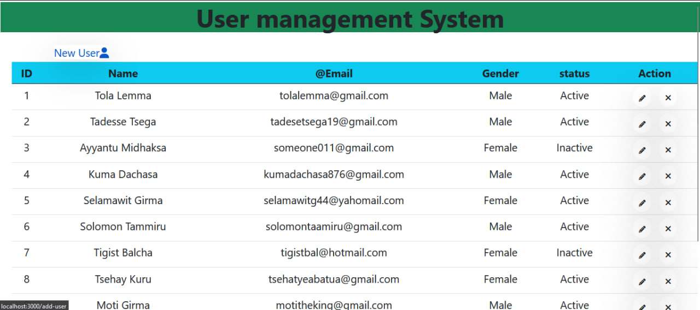
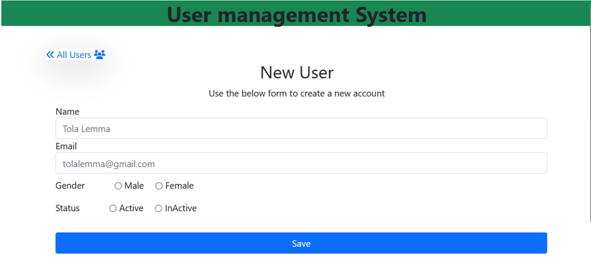
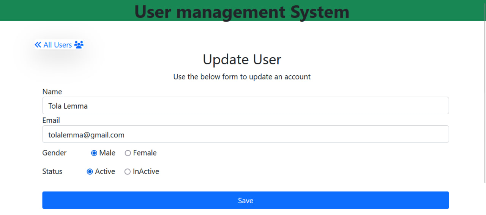

# User Management using Node, Express, and MongoDB

This is a simple user management API that allows you to perform <strong>CRUD</strong> (create, read, update, delete) operations on user data. The API is built using <strong>Node.js</strong>, <strong>Express</strong>, and <strong>MongoDB</strong>, and uses <strong>EJS</strong> for rendering views.

# Features
- Create, read, update, and delete user data
- No authentication and authorization
- Deployed on Vercel
# Installation
To run this API on your local machine, you will need to have Node.js and MongoDB installed. Once you have these installed, follow these steps:

1. Clone this repository
2. Run  `npm install` to install dependencies
3. Create a `.env` file with your MongoDB connection string
4. Run `npm start` to start the API
# Usage
Once the API is running, you can use it to perform CRUD operations on user data. 
# Contributing
Contributions are welcome! If you'd like to contribute to this project, please create a pull request with your changes.

# License
This project is licensed under the MIT license. See the LICENSE file for more details.

# Technologies used
* This project was built using <strong>Node.js and Express</strong>, two popular open-source technologies for building web applications with JavaScript.
* <strong>MongoDB</strong> was used as the database for this project.
* <strong>EJS</strong> was used as the view engine to render HTML templates.
* This project is deployed on <strong>Vercel</strong>, a cloud platform for deploying and hosting web applications.
* The code for this project is hosted on <strong>GitHub</strong>, a web-based hosting service for version control and collaboration.
 # Screenshots
 <strong>All users dashboard </strong>

 <strong>Add new users dashboard</strong>

  <strong>Update users dashboard</strong>
